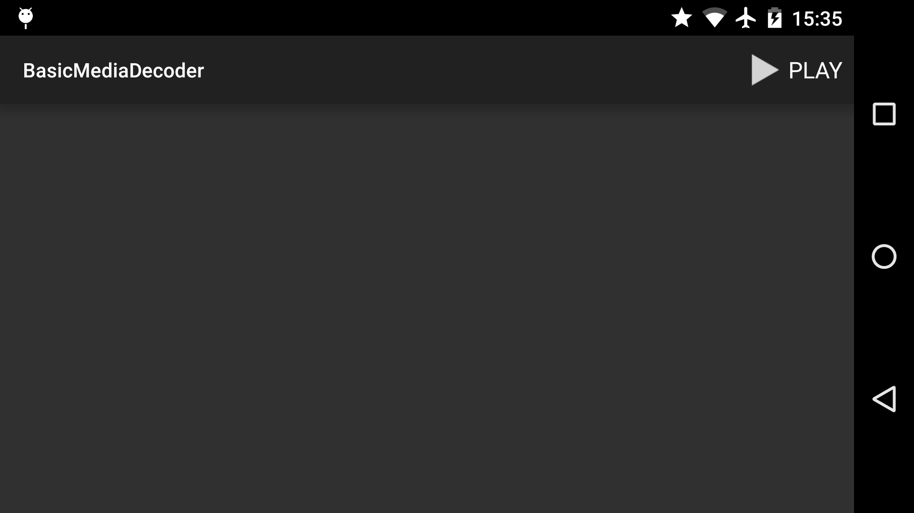
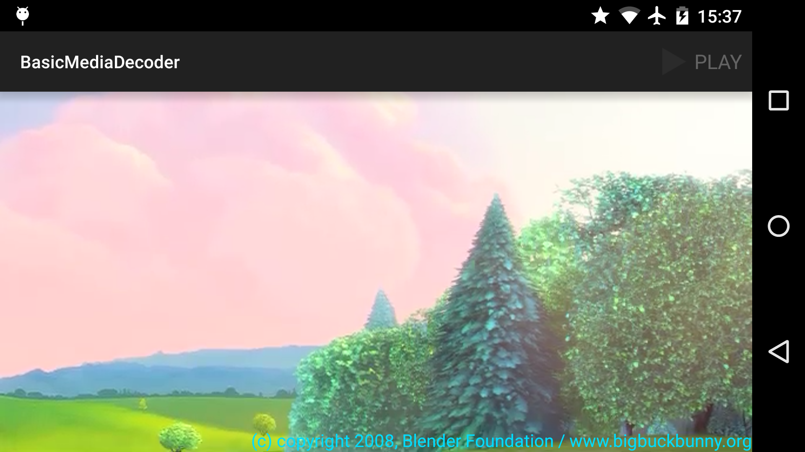

Android BasicMediaDecoder Sample
================================

This sample shows how to use the MediaCoder to decode a video,
use a TimeAnimator to sync the rendering commands with the system
display frame rendering and finally render it to a TextureView.

Introduction
------------

[MediaCodec][1] was introduced in API 16, and can be used for low level (decoding/encoding) operations.
In the same API was also introduced [TimeAnimator][2], which can be used to synchronise animation frames.
Finally, [MediaExtractor][3] provides a simple way to extract demuxed media data from a data source.

The main steps are described below:

1. Create a layout with a [TextureView][4] for your activity.
2. Initialise a MediaExtractor instance with `new MediaExtractor()` and a TimeAnimator instance with
`new TimeAnimator()`.
3. To start video playback, call `setDataSource(this, videoUri, null)` on your MediaExtractor instance,
where `videoUri` is the URI of your video source.
4. On your MediaExtractor instance, call `getTrackCount()` to know how many tracks you have in your streams.
They may not all be video tracks. Deselect all tracks by calling `unselectTrack(i)` where `i` is
the index of the track.
5. Get the mime type of a track by calling `getTrackFormat(i).getString(MediaFormat.KEY_MIME)`
on your MediaExtractor instance, where `i` is the index of your selected track.
If the mime type contains "video/", then this is a video track so you can select it, using `selectTrack(i)`
on your MediaExtractor instance.
6. Create a MediaCodec instance by calling `MediaCodec.createDecoderByType(mimeType)`.
7. Configure your MediaCodec instance with `configure(trackFormat, textureView, null,  0)`,
where `trackFormat` is obtained by calling `getTrackFormat(i)` on your MediaExtractor instance.
8. Set a TimeListener on your TimeAnimation instance, and override its `onTimeUpdate(final TimeAnimator animation,
final long totalTime, final long deltaTime)` method.
9. In `onTimeUpdate`, check if the media track has reached the end of stream, using `getSampleFlags()`
on  your MediaExtractor instance and looking for `MediaCodec.BUFFER_FLAG_END_OF_STREAM` flag.
10. Still in `onTimeUpdate`, assuming this isn't the end of the sample, write the media sample to your
MediaDecoder instance, using `queueInputBuffer(index, 0, size, presentationTimeUs, flags)` method.
You will need to set up your buffers, refer to [MediaCodec][1] documentation for details.
11. After writing the media sample, you need to advance the sample, calling `advance()` on your
TimeExtractor instance (this is a blocking operation and should be done outside the main thread).
12. Finally, you can release and render the media sample by calling
`dequeueOutputBuffer(info, timeout)` and `releaseOutputBuffer(i, true)`, refer to [MediaCodec][1]
documentation for details.
13. In `onPause()` or if you have reached the end of the stream, call `end()` on your TimeAnimation instance,
then call `stop()` and `release()` on your MediaCodec instance, and finally, call `release()` on your
MediaExtractor instance.

[1]: http://developer.android.com/reference/android/media/MediaCodec.html
[2]: http://developer.android.com/reference/android/animation/TimeAnimator.html
[3]: http://developer.android.com/reference/android/media/MediaExtractor.html
[4]: http://developer.android.com/reference/android/view/TextureView.html

Pre-requisites
--------------

- Android SDK 28
- Android Build Tools v28.0.3
- Android Support Repository

Screenshots
-------------

  

Getting Started
---------------

This sample uses the Gradle build system. To build this project, use the
"gradlew build" command or use "Import Project" in Android Studio.

Support
-------

- Stack Overflow: http://stackoverflow.com/questions/tagged/android

If you've found an error in this sample, please file an issue:
https://github.com/android/media

Patches are encouraged, and may be submitted by forking this project and
submitting a pull request through GitHub. Please see CONTRIBUTING.md for more details.
