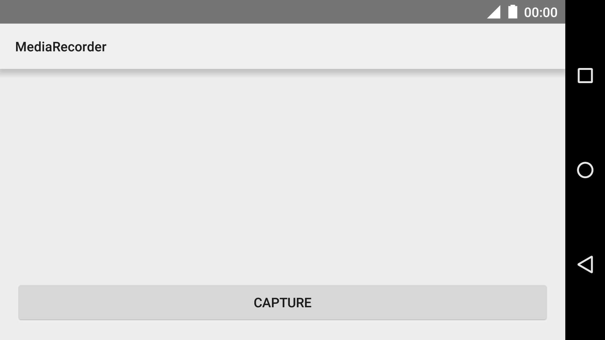

Android MediaRecorder Sample
============================

This sample uses the camera/camcorder as the A/V source for the MediaRecorder API.
A TextureView is used as the camera preview which limits the code to API 14+. This
can be easily replaced with a SurfaceView to run on older devices.

Introduction
------------

This sample shows how to use the [MediaRecorder][1] API.
It uses the [Camera][2] as input source and displays a preview on a [TextureView][3]
The sample features a button to capture the input and stop capturing afterwards.

It demonstrates how to correctly gain control and release the camera.
The sample also shows how to save the captured audio and video to persistant storage
and basic error handling.

[1]: https://developer.android.com/reference/android/media/MediaRecorder.html
[2]: https://developer.android.com/reference/android/graphics/Camera.html
[3]: https://developer.android.com/reference/android/view/TextureView.html

Pre-requisites
--------------

- Android SDK 28
- Android Build Tools v28.0.3
- Android Support Repository

Screenshots
-------------

  

Getting Started
---------------

This sample uses the Gradle build system. To build this project, use the
"gradlew build" command or use "Import Project" in Android Studio.

Support
-------

- Stack Overflow: http://stackoverflow.com/questions/tagged/android

If you've found an error in this sample, please file an issue:
https://github.com/android/media

Patches are encouraged, and may be submitted by forking this project and
submitting a pull request through GitHub. Please see CONTRIBUTING.md for more details.
