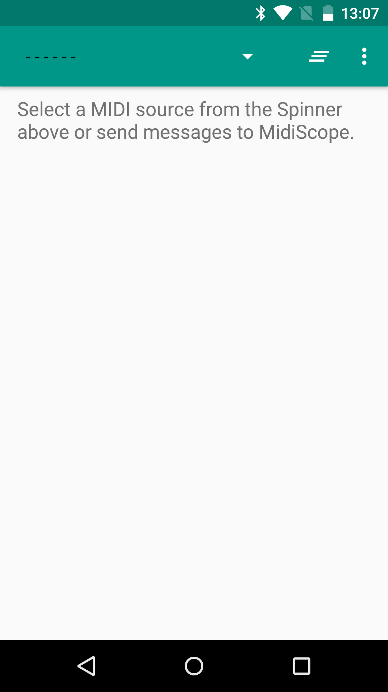
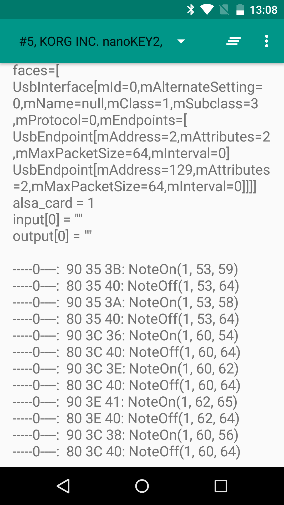

Android MidiScope Sample
========================

Sample demonstrating how to use the MIDI API to receive and process MIDI signals coming from an
attached device.

Introduction
------------

The Android MIDI API ([android.media.midi][1]) allows developers to connect a MIDI device to Android
and process MIDI signals coming from it. This sample demonstrates some basic features of the MIDI
API, such as enumeration of currently available devices (Information includes name, vendor,
capabilities, etc), notification when MIDI devices are plugged in or unplugged, and receiving MIDI
signals. This sample simply shows all the received MIDI signals to the screen log and does not play
any sound for them.
[1]: https://developer.android.com/reference/android/media/midi/package-summary.html

Pre-requisites
--------------

- Android SDK 28
- Android Build Tools v28.0.3
- Android Support Repository

Screenshots
-------------

  

Getting Started
---------------

This sample uses the Gradle build system. To build this project, use the
"gradlew build" command or use "Import Project" in Android Studio.

Support
-------

- Stack Overflow: http://stackoverflow.com/questions/tagged/android

If you've found an error in this sample, please file an issue:
https://github.com/android/media

Patches are encouraged, and may be submitted by forking this project and
submitting a pull request through GitHub. Please see CONTRIBUTING.md for more details.
