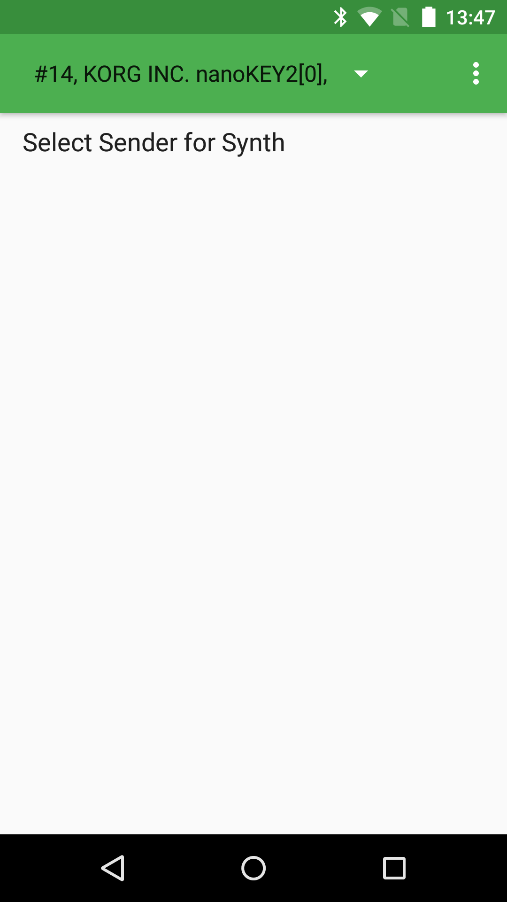

Android MidiSynth Sample
========================

Sample demonstrating how to use the MIDI API to receive and play MIDI messages coming from an
attached input device (MIDI keyboard).

Introduction
------------

The Android MIDI API ([android.media.midi][1]) allows developers to connect a MIDI device to
an Android device and process MIDI messages coming from it.

This sample demonstrates some basic features of the MIDI API, such as:

- Enumeration of currently available devices (including name, vendor, capabilities, etc)
- Notification when MIDI devices are plugged in or unplugged
- Receiving and processing MIDI messages

This sample contains a simple implementation of an oscillator and note playback.

[1]: https://developer.android.com/reference/android/media/midi/package-summary.html

Pre-requisites
--------------

- Android SDK 28
- Android Build Tools v28.0.3
- Android Support Repository

Screenshots
-------------

 

Getting Started
---------------

This sample uses the Gradle build system. To build this project, use the
"gradlew build" command or use "Import Project" in Android Studio.

Support
-------

- Stack Overflow: http://stackoverflow.com/questions/tagged/android

If you've found an error in this sample, please file an issue:
https://github.com/android/media

Patches are encouraged, and may be submitted by forking this project and
submitting a pull request through GitHub. Please see CONTRIBUTING.md for more details.
