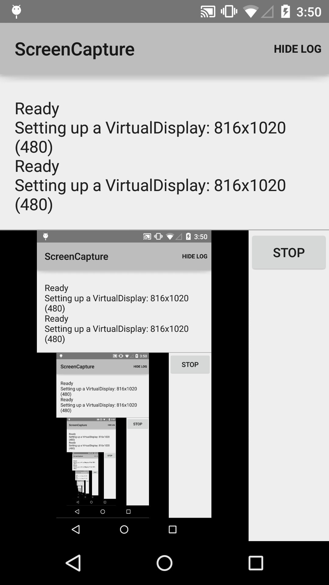

Android ScreenCapture Sample
============================

This sample demonstrates how to use Media Projection API to capture device screen in real time and
show it on a SurfaceView.

Introduction
------------

Media Projection API lets you capture the current screen through Surface.

To start media projection, you need to get an instance of [MediaProjection][1]. For this, you have
to call startActivityForResult with an Intent from
[MediaProjectionManager.createScreenCaptureIntent()][2]. This shows a confirmation dialog to the
user. When user confirms it, you will get a result code and data in onActivityResult, so pass those
to [getMediaProjection][3].

Once you get a MediaProjection, use [createVirtualDisplay][4] and bind it to a Surface.

[1]: https://developer.android.com/reference/android/media/projection/MediaProjection.html
[2]: https://developer.android.com/reference/android/media/projection/MediaProjectionManager.html#createScreenCaptureIntent()
[3]: https://developer.android.com/reference/android/media/projection/MediaProjectionManager.html#getMediaProjection(int, android.content.Intent)
[4]: https://developer.android.com/reference/android/media/projection/MediaProjection.html#createVirtualDisplay(java.lang.String, int, int, int, int, android.view.Surface, android.hardware.display.VirtualDisplay.Callback, android.os.Handler)

Pre-requisites
--------------

- Android SDK 28
- Android Build Tools v28.0.3
- Android Support Repository

Screenshots
-------------

 

Getting Started
---------------

This sample uses the Gradle build system. To build this project, use the
"gradlew build" command or use "Import Project" in Android Studio.

Support
-------

- Stack Overflow: http://stackoverflow.com/questions/tagged/android

If you've found an error in this sample, please file an issue:
https://github.com/android/media

Patches are encouraged, and may be submitted by forking this project and
submitting a pull request through GitHub. Please see CONTRIBUTING.md for more details.
